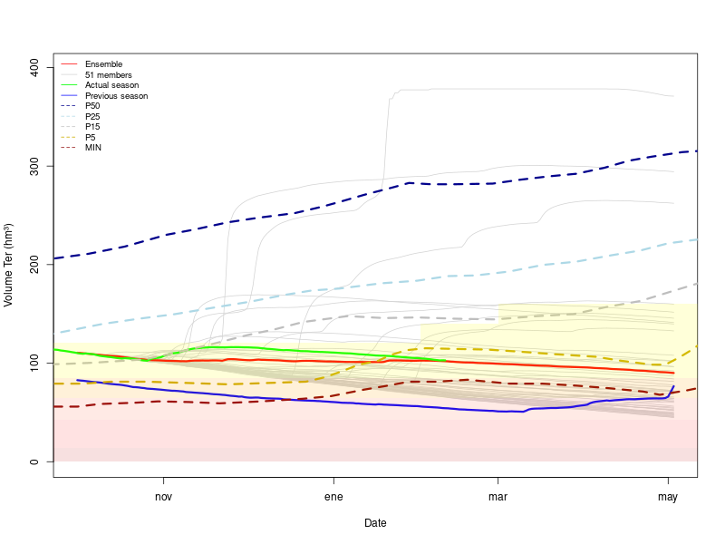
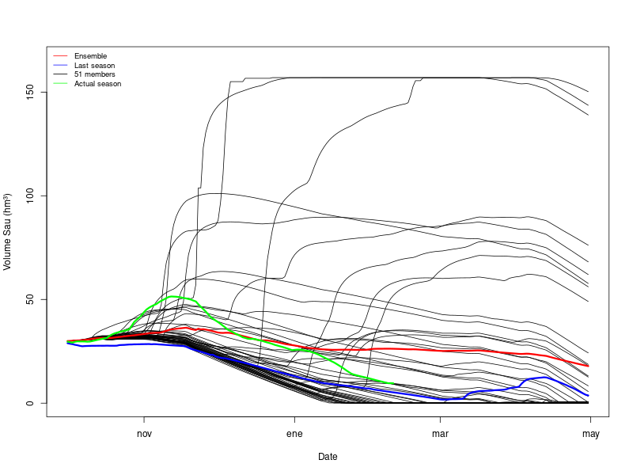
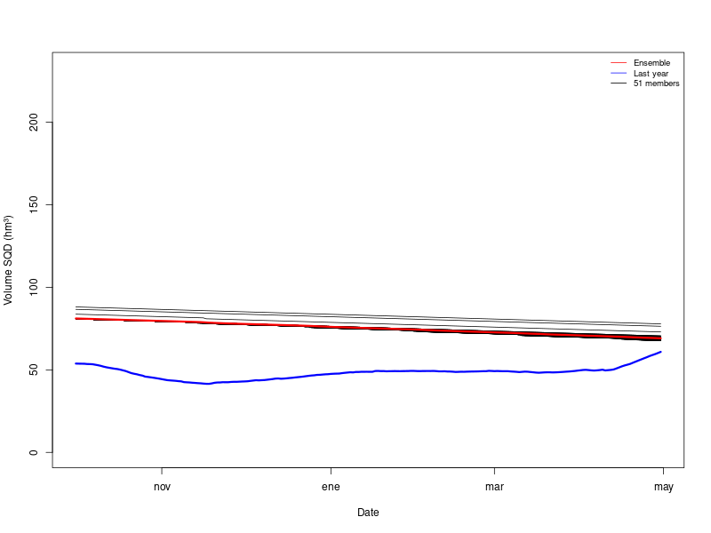

# Volume Ter System: Seasonal Forecast

This repository contains the seasonal forecast balance for the Ter River reservoirs, specifically Sau and Susqueda. The calculations are based on hydrological models driven by SEAS5 meteorological data, with inflow estimates and volume balance adjustments.

## Overview

- The seasonal forecast is **automatised** to be initialized in **any season**, example here of **October 1, 2024**.
- The **inflow to Sau** is estimated using hydrological models, with SEAS5 meteorology as input.
- The balance can assume two outflows: (1) outflows from both reservoirs are equal to the median of the last x days (defined by the user), (2) the same outflow for a similar situation in the past. In this case the second options was selected and the previous season (October 2023 - May 2024) was used.
- In **Sau**, sometimes the volume is negative (many members) or exceeds the maximum (a few members). To correct this, if the volume falls below min_vol or exceeds max_vol, inflows are assumed to be equal to outflows for that specific day.
- In **Susqueda**, this issue does not occur frequently, but the same is applied when happens.

## Results

### The whole Ter system, comparing with ACA method for predictions

### SAU

### SQD (Susqueda)

## Interpretation of the Plots
- **Black lines**: Different forecast members.
- **Red line**: Ensemble mean.
- **Blue line**: Observed values from the previous season (October 2023 – April 2024).
- When updated data becomes available, the observed evolution of the current season will be added.

## Repository Structure
- **/plot/**: Contains results.
- **/in/**: Input datasets used for the models.
- **/out/**: Outputs from the codes.
- **/download/**: Contains the raw SEAS5 data downloading.

## Codes
- **main**: you only need to change 3 parameters, and another 3 optional, in order to run the whole workflow.
- **1_calculated_balance.R**: calculate and fix the water balance from the original data.
- **2_river.R**: implement hydrologic modelling forced by SEAS5 to obtain forecast ensemble of discharge of the Ter river going into Sau Reservoir.
- **3_forecast_balance_sau.R**: calculate volumen ensemble forecasting for the next coming months for Sau Reservoir.
- **3_forecast_balance_sqd.R**: calculate volumen ensemble forecasting for the next coming months for Susqueda Reservoir.
- **3_forecast_balance_ter.R**: calculate volumen ensemble forecasting for the next coming months for the whole Ter system

The balance and volume forecasts provides reasonable estimates.

