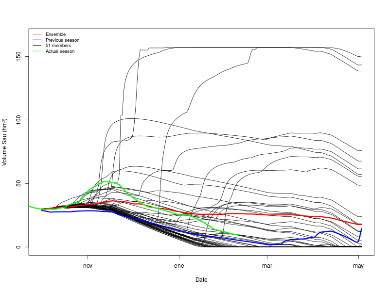
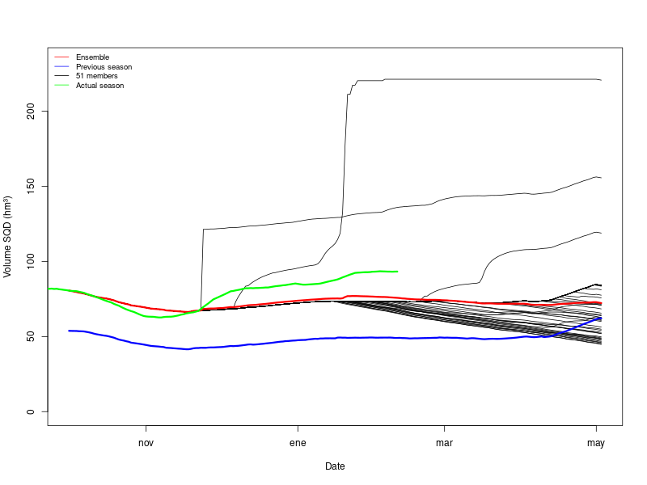

# Volume Ter System: Seasonal Forecast

This repository contains the seasonal forecast balance for the Ter River reservoirs, specifically Sau and Susqueda. The calculations are based on hydrological models driven by SEAS5 meteorological data, with inflow estimates and volume balance adjustments.

## Overview

- The seasonal forecast is initialized on **October 1, 2024**.
- The **inflow to Sau** is estimated using hydrological models, with SEAS5 meteorology as input.
- The balance assumes that **outflows from both reservoirs** are equal to the median of the last few days.
- In **Sau**, sometimes the volume is negative (many members) or exceeds the maximum (a few members). To correct this, if the volume falls below 5% or exceeds 95%, inflows are assumed to be equal to outflows for that specific day.
- In **Susqueda**, this issue does not occur, so no correction is necessary.

## Results

### SAU

### SQD (Susqueda)

## Interpretation of the Plots
- **Black lines**: Different forecast members.
- **Red line**: Ensemble mean.
- **Blue line**: Observed values from the previous season (October 2023 – April 2024).
- When updated data becomes available, the observed evolution of the current season will be added.

## Repository Structure
- **/plot/**: Contains results.
- **/in/**: Input datasets used for the models.
- **/out/**: Outputs from the codes

## Codes
- **1_calculated_balance.R**
- **2_river.R**
- **3_forecast_balance_sau.R**
- **3_forecast_balance_sqd.R**

This first version of the balance provides reasonable estimates and aligns with last year’s observations.

